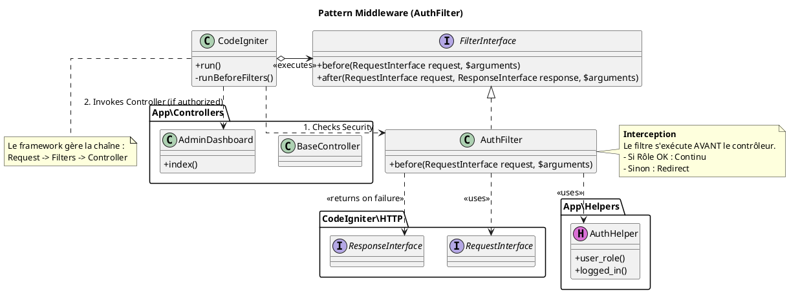
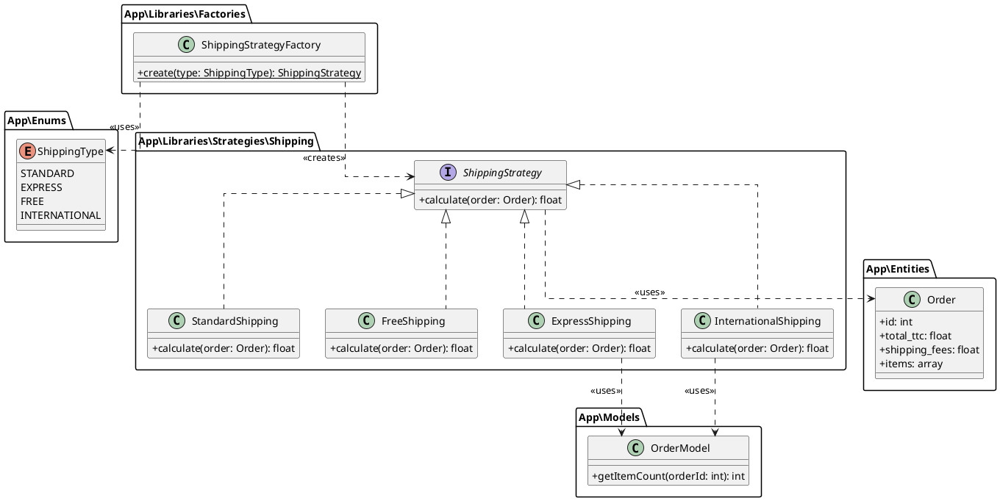

# Diagramme de Classes Détaillé et Patrons de Conception

## Illustrations des Patrons de Conception

### 1. Middleware (Chain of Responsibility)
Utilisé pour le filtrage des requêtes HTTP (Authentification).

### 2. Strategy (Stratégie) et Factory (Fabrique)
Implémentation unifiée pour le calcul des frais de port. La Factory crée la bonne Strategy.

