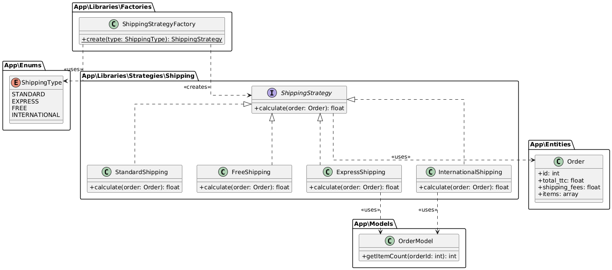
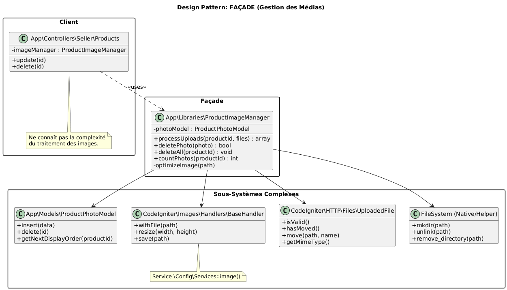

AIGNELOT Youenn  
BERNARD Adam  
FILMONT Felix  
LACHAISE Mattys  
PLU Niels

# Rapport Analyse et Conception - Patrons de Conception

Ce document présente l'analyse technique des patrons de conception (Design Patterns) identifiés et mis en œuvre (ou à mettre en œuvre) dans le projet e-commerce.

Conformément aux consignes, nous avons sélectionné trois patrons de conception. 
Toutefois, l'implémentation du **Middleware** étant grandement facilitée par CodeIgniter 4, nous avons décidé d'ajouter un patron **Bonus** :

1.  **Middleware** (Filtrage des requêtes) - *Pattern structurel/comportemental (Chain of Responsibility)*
2.  **Strategy** (Calculs métier variables) - *Pattern comportemental*
3.  **Factory** (Création des stratégies) - *Pattern créationnel*
4.  **Façade** (Simplification de sous-systèmes complexes) - *Pattern structurel (Bonus)*

---

## 1. Patron Middleware (Interception / Chain of Responsibility)

### Justification
Dans une application web e-commerce, de nombreuses routes doivent être protégées (ex: accès au Dashboard Vendeur, Panier utilisateur, Administration). Plutôt que de répéter le code de vérification de session (`if (!logged_in) ...`) dans chaque méthode de chaque contrôleur, le patron **Middleware** permet d'intercepter la requête HTTP *avant* qu'elle n'atteigne le contrôleur. Cela centralise la logique de sécurité et facilite la maintenance.

### Illustration
Dans le framework CodeIgniter 4, ce concept est implémenté via les **Filters**.


Le filtre agit comme un gardien : si la condition (authentification, rôle) n'est pas remplie, il interrompt la chaîne et redirige l'utilisateur.

### Implémentation
L'implémentation se trouve dans `App\Filters\AuthFilter.php`.

**Extrait de code (`src/app/Filters/AuthFilter.php`) :**
```php
class AuthFilter implements FilterInterface
{
    public function before(RequestInterface $request, $arguments = null)
    {
        $role = user_role(); // Fonction helper personnalisée

        // 1. Vérifie si l'utilisateur est connecté
        if ($role === null) {
            return redirect()->to('/login')->with('error', 'Vous devez être connecté.');
        }

        // 2. Vérification des rôles (Admin, Seller, etc.) si spécifiés
        if (!empty($arguments)) {
            if (!in_array($role->value, $arguments)) {
                return redirect()->to('/')->with('error', 'Accès non autorisé.');
            }
        }
    }

    public function after(RequestInterface $request, ResponseInterface $response, $arguments = null) {
        // Logique post-traitement si nécessaire
    }
}
```
Ce filtre est ensuite enregistré dans `Config/Filters.php` pour s'appliquer à des routes spécifiques (ex: `/admin/*`, `/seller/*`).

---

## 2. Patron Strategy (Stratégie)

### Justification
Notre analyse montre que les règles de calcul des frais de port peuvent varier selon plusieurs critères (nombre de produit, destination, type de livraison choisi par le client). Utiliser une série de `if/else` ou un `switch` géant dans l'entité `Order` rendrait le code rigide et difficile à tester, surtout avec l'ajout de modes comme "International" ou "Express" qui nécessitent des dépendances supplémentaires (ex: `OrderModel` pour compter les articles).
Le patron **Strategy** permet d'encapsuler chaque algorithme de calcul dans une classe dédiée.

### Illustration


Le diagramme ci-dessus montre une interface commune `ShippingStrategy` implémentée par plusieurs stratégies concrètes : `StandardShipping`, `ExpressShipping`, `FreeShipping`, `InternationalShipping`.

### Implémentation

**Interface :**
```php
// app/Libraries/Strategy/Shipping/ShippingStrategy.php
interface ShippingStrategy
{
    /**
     * Calculates the shipping fees for a given order.
     *
     * @param Order $order
     * @return float
     */
    public function calculate(Order $order): float;
    
}
```

**Exemple de Stratégie Concrète (International) :**
Cette stratégie utilise `OrderModel` pour récupérer le nombre d'articles, simulant une contrainte logistique.
```php
// app/Libraries/Strategies/Shipping/InternationalShipping.php
class InternationalShipping implements ShippingStrategy
{
    public function calculate(Order $order): float
    {
        // Higher shipping costs for international
        $shippingCost = 39.99;

        $itemCount = 0;
        
        if ($order->id) {
            $orderModel = new OrderModel();
            $itemCount = $orderModel->getItemCount($order->id);
        }

        if ($itemCount > 1) {
            $shippingCost += ($itemCount - 1) * 2.50;
        }

        return $shippingCost;
    }
}
```

---

## 3. Patron Factory (Fabrique Simple)

### Justification
Avec plusieurs stratégies disponibles (`Standard`, `Express`, `Free`, `International`), le code client (ex: un contrôleur ou un service de panier) ne doit pas savoir quelle classe concrète instancier. S'il faisait `new ExpressShipping()`, il serait fortement couplé aux classes concrètes.
Le patron **Factory** (ici implémenté via `ShippingStrategyFactory`) centralise la logique de création. Si demain nous renommons une classe ou changeons la manière dont une stratégie est construite, seul la Factory change.

### Illustration
Le diagramme complet montre que `ShippingStrategyFactory` dépend de l'enum `ShippingType` pour décider quelle instance de `ShippingStrategy` retourner.


### Implémentation

**Factory :**
```php
// app/Libraries/Factories/ShippingStrategyFactory.php
class ShippingStrategyFactory
{
    /**
     * Creates a ShippingStrategy instance based on the requested type.
     *
     * @param ShippingType $type The shipping type
     * @return ShippingStrategy
     * @throws InvalidArgumentException If the shipping type is not recognized
     */
    public static function create(ShippingType $type): ShippingStrategy
    {
        return match ($type) {
            ShippingType::STANDARD => new StandardShipping(),
            ShippingType::EXPRESS => new ExpressShipping(),
            ShippingType::FREE => new FreeShipping(),
            ShippingType::INTERNATIONAL => new InternationalShipping(),
        };
    }
}
```

**Utilisation dans le code client :**
```php
// Pas encore dévellopé
```

---

## 4. Patron Façade (Bonus)

### Justification
Dans notre application e-commerce, la gestion des images produits est une tâche complexe qui implique de multiples sous-systèmes : système de fichiers (création de dossiers, droits), traitement d'image (redimensionnement, optimisation), et base de données.
Sans une abstraction, les contrôleurs (`ProductsController`) se retrouveraient pollués par cette logique.
Le patron **Façade** a été choisi pour fournir une interface unifiée (une "façade") simplifiée à ce sous-système complexe. Il permet au contrôleur de dire simplement "Traite ces uploads", sans se soucier des détails d'implémentation.

### Illustration
La classe `ProductImageManager` agit comme une **Façade**. Elle masque la complexité des bibliothèques de manipulation d'images (`Config\Services::image()`), du modèle de base de données (`ProductPhotoModel`), et des fonctions natives de gestion de fichiers PHP.

Le client (le contrôleur) n'interagit qu'avec la Façade.



### Implémentation

**Façade (`src/app/Libraries/ProductImageManager.php`) :**
```php
class ProductImageManager
{
    // ...

    public function processUploads(int $productId, array $files): array
    {
        // ... Logique de création de dossier ...
        
        // Délégation des règles métier
        $currentCount = $this->countPhotos($productId);
        
        foreach ($files as $file) {
            // ... Validation technique (Mime, Taille) ...
            
            // 1. Sous-système Fichier : Déplacement
            $file->move($productDir, $newName);
            
            // 2. Sous-système Image : Optimisation (Service CI4)
            $this->optimizeImage($finalPath);
            
            // 3. Sous-système BDD : Insertion
            $this->photoModel->insert([...]);
        }
        return ['uploaded' => $uploadedData, 'errors' => $errors];
    }
}
```

**Utilisation dans le Contrôleur (`Products.php`) :**
```php
// Le contrôleur est découplé de la complexité de l'upload
$photoResult = $this->imageManager->processUploads($productId, $files);
```

---

## 5. Contexte Architectural (Annexes)

Pour situer l'utilisation de ces patrons de conception dans l'application globale, voici les diagrammes de classes complets générés lors de l'analyse technique.

*Note : Ces diagrammes ont été générés à l'aide de l'outil PlantUML. Nous nous excusons pour la qualité du rendu de certains d'entre eux, qui s'avèrent moins lisibles que prévu (notamment le Diagramme des Entités).*

### 4.1. Couche Entités
Représentation des objets métier et de leurs relations.


### 4.2. Couche Modèles
Représentation de la logique d'accès aux données.


### 4.3. Couche Contrôleurs
Représentation de la structure MVC et des différents contrôleurs (Admin, Seller, Client).


