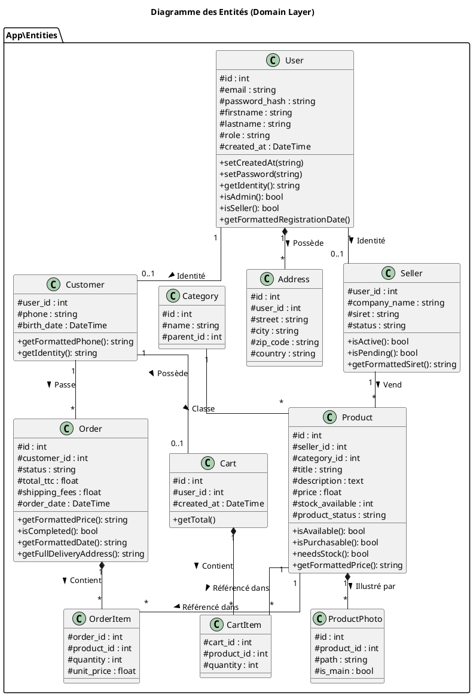
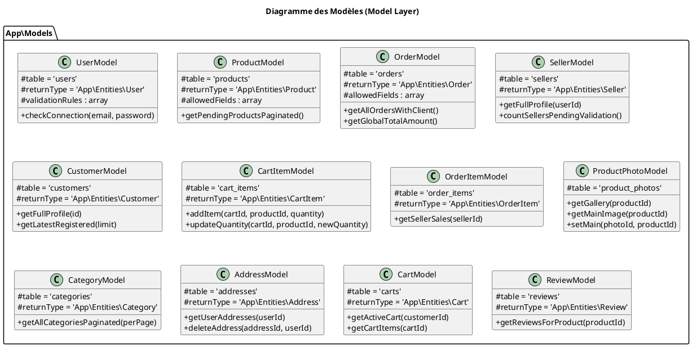
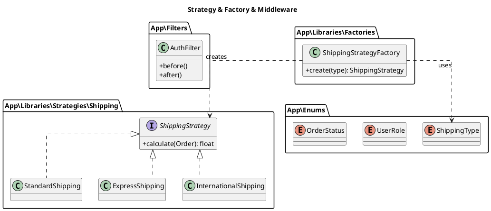

# Dossier de Conception Détaillée - Diagrammes de Classes

Ce document rassemble les diagrammes de classes de l'application, découpés par couches logiques pour en faciliter la lecture.

## 1. Couche Domaine (Entités)
Ce diagramme représente les objets métier manipulés par l'application et leurs relations.

## 2. Couche Accès aux Données (Modèles)
Ce diagramme montre les classes responsables de l'interaction avec la base de données.

## 3. Couche Présentation (Contrôleurs)
Ce diagramme détaille l'ensemble des contrôleurs de l'application.

```plantuml
@startuml
title Diagramme des Contrôleurs
skinparam classAttributeIconSize 0

package "App\\Controllers" {
    class BaseController {
        # session
        # validator
    }

    class Home {
        + index()
    }

    namespace Admin {
        class AdminBaseController {
            # productModel
            # sellerModel
            # userModel
            # orderModel
            # reviewModel
            # categoryModel
        }

        class Dashboard {
            + index()
        }
        
        class Users {
            + index()
            + approveSeller($id)
            + refuseSeller($id)
            + delete($id)
        }
        
        class Products {
            + index()
            + approve($id)
            + reject($id)
            + delete($id)
        }
        
        class Categories {
            + index()
            + new()
            + edit($id)
            + save()
            + delete($id)
        }
        
        class Orders {
            + index()
            + detail($id)
        }
        
        class Reviews {
            + index()
            + changeStatus($id, $newStatus)
            + delete($id)
        }
    }

    namespace Seller {
        class SellerBaseController {
            # productModel
            # orderItemModel
            # categoryModel
            # productPhotoModel
            # reviewModel
            # sellerModel
        }

        class Dashboard {
            + index()
        }
        
        class Products {
            + index()
            + new()
            + create()
            + edit($id)
            + update($id)
            + delete($id)
            + restore($id)
        }
        
        class Orders {
            + index()
            + detail($id)
            + ship($id)
        }

        class Reviews {
            + index()
        }

        class Shop {
            + edit()
            + update()
        }
    }

    namespace Client {
        class ClientBaseController {
            # orderModel
            # orderItemModel
            # userModel
            # addressModel
            # reviewModel
            # customerModel
        }

        class Dashboard {
            + index()
        }

        class Orders {
            + index()
            + show($id)
        }

        class Addresses {
            + index()
            + new()
            + create()
            + delete($id)
        }

        class Profile {
            + index()
            + edit()
            + update()
        }

        class Reviews {
            + create()
            + store()
        }
    }
}

' Relations d'héritage
BaseController <|-- Home
BaseController <|-- Admin.AdminBaseController
BaseController <|-- Seller.SellerBaseController
BaseController <|-- Client.ClientBaseController

Admin.AdminBaseController <|-- Admin.Dashboard
Admin.AdminBaseController <|-- Admin.Users
Admin.AdminBaseController <|-- Admin.Products
Admin.AdminBaseController <|-- Admin.Categories
Admin.AdminBaseController <|-- Admin.Orders
Admin.AdminBaseController <|-- Admin.Reviews

Seller.SellerBaseController <|-- Seller.Dashboard
Seller.SellerBaseController <|-- Seller.Products
Seller.SellerBaseController <|-- Seller.Orders
Seller.SellerBaseController <|-- Seller.Reviews
Seller.SellerBaseController <|-- Seller.Shop

Client.ClientBaseController <|-- Client.Dashboard
Client.ClientBaseController <|-- Client.Orders
Client.ClientBaseController <|-- Client.Addresses
Client.ClientBaseController <|-- Client.Profile
Client.ClientBaseController <|-- Client.Reviews

@enduml
```

## 4. Logique Métier & Patrons (Business Logic)
Ce diagramme isole les patrons de conception et les services transverses.

